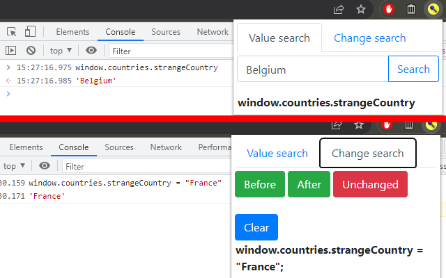

JS Search
=========
_Emile Sonneveld_

2 tools:
- "Value search"': When you know what value the variable has, you can use this to find how to acces this variable.
- "Change search": When you want to find what variables are changed after performing an action.

